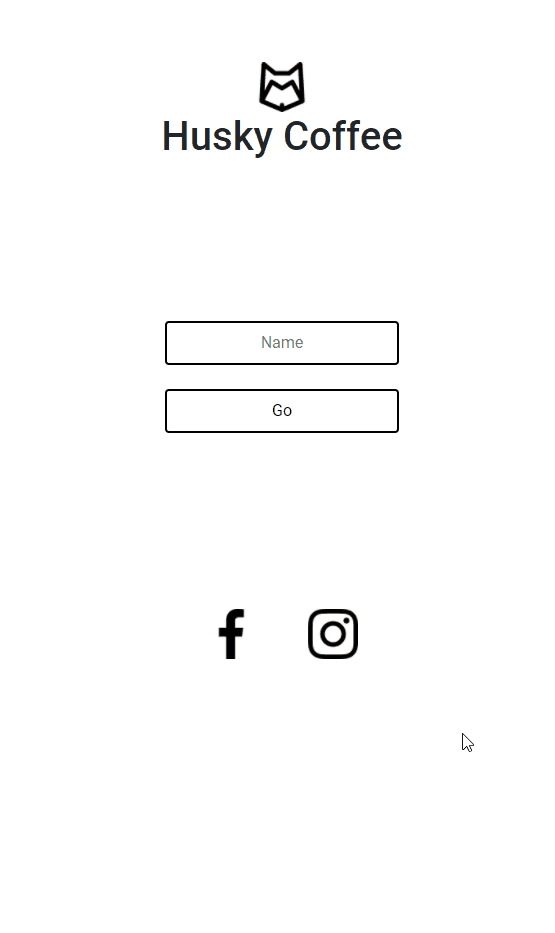

# README

<h1 align="center"> HUSKY COFFEE </h1>

 
    <a href="#sobre">Sobre</a>
    <a href="#funcionalidades">Funcionalidades</a>
    <a href="#tecnologias">Tecnologias</a>
    <a href="#Autor">Autor</a>
 

 # Sobre
 

 
Sistema de realizar pedidos dentro de uma cafeteria, inspirado no sistema minimalista do "The Coffee" utilizando html, css, js, jquery, bootstrap e firebase

 
Você mesmo pode conferir o projeto clicando nesse <a href="https://yutaronegi.github.io/HuskyCoffee/">Link</a>

 
O site está 100% em inglês para treinar o meu desenvolvimento com projetos em inglês

 # Funcionalidades 
<ul>
    <li>Informar seu nome</li>
    <li>Realizar Pedido</li>
    <li>Calcular preço</li>
    <li>Modificar valor do menu, caso logado como administrador</li>
 </ul>

 # Tecnologias
 <ul>
    <li>HTML</li>
    <li>CSS</li>
    <li>Javascript</li>
    <li>Jquery</li>
    <li>Bootstrap</li>
    <li>Firebase</li>
    
 </ul>

 # Autor

 <ul>
    <li>Yutaro Negi</li>
    <li><a href="https://www.linkedin.com/in/yutaronegi/">Linkedin</a></li>
    <li>(11) 94194-5061</li>
    <li>souza_yutaro@hotmail.com</li>
 </ul>

